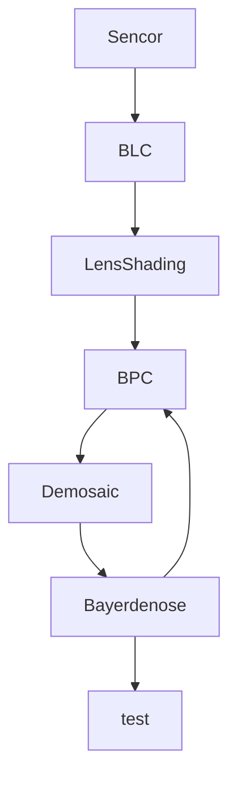

# 梯度下降法

# 可视化
通过计算机将数据转换为图形。渲染

# 光源
和入射光有关

# 近似衡等变化

残差为0

神经元

空域注意力

$$\alpha = softmax(W_{i}a + b_{i})$$

# ISP(Image Singal Processing)

DL for ISP

PyNET

## Deep Learning for Image Restoration

Denosing and super-resolution

多幅输入平均减少噪声干扰

## Semi-coupled Dictionary Learning

加权映射

残差学习学习和深度去噪

恒等映射

序列信号, 图像到视频

导师驱动：改进

序列建模问题

长期依赖，必须存在。只要是序列

* 截断梯度
    * 当参数梯度大于一定阈值时候，将它截断为一个较小数值。
        * 参数更新时候，逐元素阶段Mini-batch
        * 其他
* 门控训话单元(GRU)
    * 门机制

banti1,带有Peephole连接的LSTM

## 递归神经网络

* 构造树的方法
    * 不依赖于数据的树结构
    * ss
    * dfs
* 隐形知识：隐含的，潜意识难以表达的
    * 比如：怎么行走，或者猫和狗的样子有什么不同
* 明确的、可陈述的知识
    * 常识性知识
    * 具体的知识

图神经网络

## Image Caption 图像翻译

人骑马
描述图像内容

*before*
$$ h = hanh(Wxh * x + Whh * h)$$

*after*
$$ h = hanh(Wxh * x + Whh * h + Wih * v)$$

### DataSets

* MS COCO Dataset ---MicroSoft
